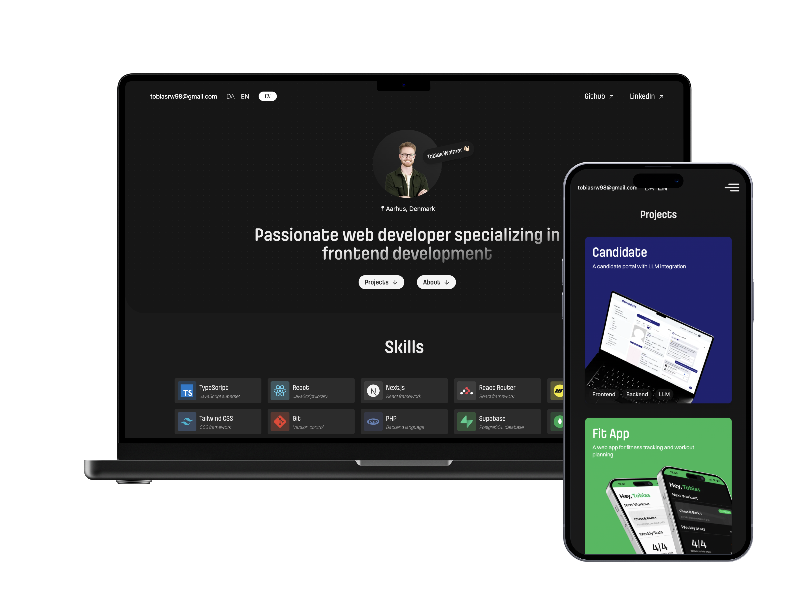

# Portfolio Project

My personal portfolio website built with Next.js and TypeScript, designed to give you a look into who I am as a developer. Browse through my latest projects to see the technologies I work with or go to the about section and read a little bit about me.

  
  

       
    <h3>See it in action</h3>
    

      <a href="https://portfolio.tobiaswolmar.dk/">🌐 Live Site</a>
    

  

   

## Techstack

## Features

- 🌐 Bilingual support (Danish/English)
- 📱 Responsive design
- ⚡ Fast performance with Next.js
- 🎨 Modern UI with Tailwind CSS
- 📊 Project showcase
- 📝 About me section
